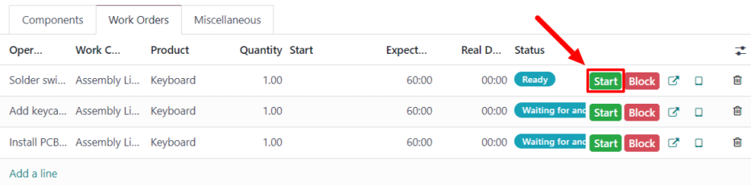
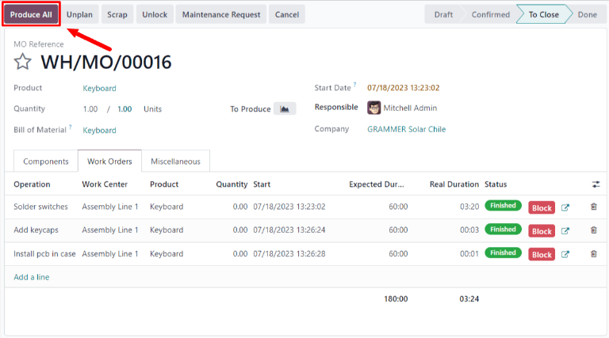

======================
One-step manufacturing
======================

.. |BOM| replace:: :abbr:`BoM (Bill of Materials)`

Odoo *Manufacturing* allows users to manufacture products using one, two, or three steps. When using
one-step manufacturing, Odoo creates a manufacturing order, but does not generate transfers for the
movement of components out of inventory or finished products into stock. Inventory counts still
update based on the number of components used and products manufactured, but the act of transferring
them to and from inventory is not tracked.

.. tip::
   The number of steps used in manufacturing is set at the warehouse level, allowing for each
   warehouse to use a different number of steps. To change the number of steps used for a specific
   warehouse, begin by navigating to :menuselection:`Inventory --> Configuration --> Warehouses`,
   then select a warehouse from the :guilabel:`Warehouses` screen.

   On the :guilabel:`Warehouse Configuration` tab, find the :guilabel:`Manufacture` radio input field
   and select one of the three options: :guilabel:`Manufacture (1 step)`, :guilabel:`Pick components
   and then manufacture (2 steps)`, or :guilabel:`Pick components, manufacture and then store
   products (3 steps)`.

   .. image:: one_step_manufacturing/manufacturing-type.png
      :align: center
      :alt: The Manufacture radio input field on a warehouse configuration page.

.. important::
   Products must be properly configured before they can be manufactured in Odoo. For details on how
   to do so, see the documentation on how to :ref:`configure a product for manufacturing
   <manufacturing/management/configure-manufacturing-product>`.

Create manufacturing order
==========================

To manufacture a product in Odoo *Manufacturing*, begin by navigating to
:menuselection:`Manufacturing --> Operations --> Manufacturing Orders`, then click :guilabel:`New`
to create a new manufacturing order.

On the new manufacturing order, select the product to be produced from the :guilabel:`Product`
drop-down menu. The :guilabel:`Bill of Material` field will auto-populate with the associated Bill
of Materials (BoM).

If a product has more than one |BOM| configured for it, the specific |BOM| can be selected in the
:guilabel:`Bill of Material` field, and the :guilabel:`Product` field will auto-populate with the
associated product.

After a |BOM| has been selected, the :guilabel:`Components` and :guilabel:`Work Orders` tabs will
auto-populate with the components and operations that were specified on the |BOM|. If additional
components or operations are required for the manufacturing order being configured, they can be
added to the :guilabel:`Components` and :guilabel:`Work Orders` tabs by clicking :guilabel:`Add a
line`.

Process manufacturing order
===========================

A manufacturing order is processed by completing all of the work orders listed under its
:guilabel:`Work Orders` tab. This can be done on the manufacturing order itself, or from the work
order tablet view.

Basic workflow
--------------

To complete work orders from the manufacturing order itself, begin by navigating to
:menuselection:`Manufacturing --> Operations --> Manufacturing Orders`, then select a manufacturing
order.

On the manufacturing order page, select the :guilabel:`Work Orders` tab. Once work begins on the
first operation that needs to be completed, click the :guilabel:`Start` button for that operation.
Odoo *Manufacturing* will then start a timer that keeps track of how long the operation takes to
complete.

When the operation is completed, click the :guilabel:`Done` button for that operation. Repeat the
same process for each operation listed on the :guilabel:`Work Orders` tab.

.. image:: one_step_manufacturing/done-button.png
   :align: center
   :alt: The Done button for an operation on a manufacturing order.

After completing all of the operations, click :guilabel:`Produce All` at the top of the screen to
mark the manufacturing order as :guilabel:`Done` and register the manufactured product(s) into
inventory.

Tablet view workflow
--------------------

To complete the work orders for a manufacturing order using the tablet view, begin by navigating to
:menuselection:`Manufacturing --> Operations --> Manufacturing Orders`, then select a manufacturing
order.

Next, click on the :guilabel:`Work Orders` tab, then select the :guilabel:`tablet view` button on
the line of the first operation that will be processed. This opens the tablet view.

.. image:: one_step_manufacturing/tablet-view-button.png
   :align: center
   :alt: The tablet view button for a work order on a manufacturing order.

After opening the tablet view, Odoo *Manufacturing* automatically starts a timer to keep track of
how long the operation takes to complete. After completing the operation, click the :guilabel:`Mark
as Done` button in the top right of the tablet view.

.. image:: one_step_manufacturing/mark-as-done.png
   :align: center
   :alt: The Mark as Done button in the manufacturing tablet view.

Clicking :guilabel:`Mark as Done` while there is at least one more operation left to complete will
open a page that lists the next operation. Click on that operation to open it in the tablet view.

Once the final operation for the manufacturing order has been reached, a :guilabel:`Mark as Done and
Close MO` button will appear on the tablet view in addition to the :guilabel:`Mark as Done` button.
Click :guilabel:`Mark as Done and Close MO` to mark the manufacturing order as :guilabel:`Done` and
register the manufactured product(s) into inventory.

It is also possible to complete the final operation while keeping the manufacturing order open, by
clicking :guilabel:`Mark as Done`. In this case, the manufacturing order can be closed at a later
time by clicking the :guilabel:`Produce All` button on the order.
