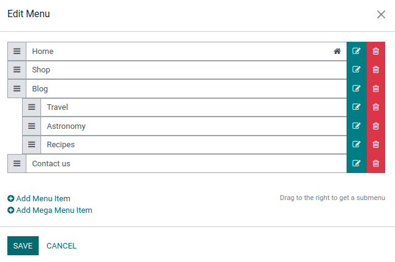
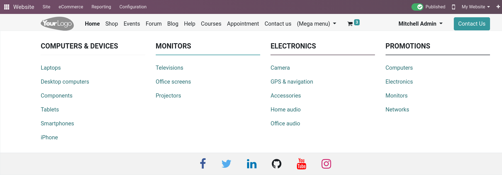

=====
Menus
=====

Menus are used to organize your website’s content effectively and help visitors navigate through
your web pages effectively. User-friendly and well-structured website menus also play a crucial role
in improving :doc:`search engine rankings <seo>`.

Odoo allows you to customize the content and appearance of these menus to your needs.

Menu editor
===========

To edit your website's menu, go to :menuselection:`Website --> Site --> Menu Editor`. From there,
you can:

- rename a menu item or change its URL using the :guilabel:`Edit Menu Item` icon;
- delete a menu item using the :guilabel:`Delete Menu Item` icon;
- move a menu item by drag and dropping it to the desired place in the menu;
- create a drop-down menu by drag and dropping the sub-menu items to the right, underneath their
  parent menu.

.. note::
  - By default, pages are added to the menu when :doc:`they are created <../pages>`.
  - You can also access the menu editor by clicking :guilabel:`Edit`, then selecting any menu item
    and clicking the :guilabel:`Edit menu` icon.

Creating menu items
-------------------

To create a menu item, click :guilabel:`Add Menu Item`, then, in the pop-up window that appears on
the screen, enter the :guilabel:`Name` and :guilabel:`Url` of the related page. Click :guilabel:`OK`
to create the menu item.

.. tip::
   Type `/` in the :guilabel:`URL` field to search for an existing page of your website.

Mega menus
----------

Mega menus are similar to drop-down menus, but instead of a simple list of sub-menus, they display a
panel divided into groups of navigation options. This makes them suitable for websites with large
amounts of contents, as they can help include all of your web pages in the menu, while still making
all menu options visible at once. Mega menus can also be structured more visually than regular
drop-down menu items, for example through layout, typography and icons.

To create a mega menu, proceed as follows:

#. Go to :menuselection:`Website --> Site --> Menu Editor`, click :guilabel:`Add Mega Menu Item`,
   then enter a :guilabel:`Name`, and click :guilabel:`OK`.
#. Click the mega menu in the navigation bar, then click :guilabel:`Edit`.
#. Click a title or a menu option to modify it:

   - Edit its text directly in the building block;
   - Edit the link by clicking the :guilabel:`Edit link` button in the small preview popup, then
     enter type `/` to search for a page on your website, or `#` to search for an existing custom
     anchor.

  .. image:: menus/mega-menu-option.png
     :alt: Edit a mega menu option

.. note::
   Each mega menu option is an individual building block, which means you can:

   - move it by drag and dropping the block to the desired position in the mega menu;
   - delete it by deleting the block;
   - edit its text directly in the related block and format it using the :guilabel:`Customize` tab
     in the website builder.

Customization
=============

To customize the appearance of your website's menu, click :guilabel:`Edit` and select a menu item.
You can then adapt the fields in the :guilabel:`Customize` tab, for example, change the
:guilabel:`Template` for the header and adapt the appearance of the navigation bar.

To adapt the general layout of a mega menu, select the mega menu, then go the the
:guilabel:`Mega menu` section in the website builder and select the desired :guilabel:`Template` and
:guilabel:`Size`. Since mega menus are composed of building blocks, you can also customize each
component individually (e.g., add text, formatting, icons, etc. or modify its size), like any other
building block.
